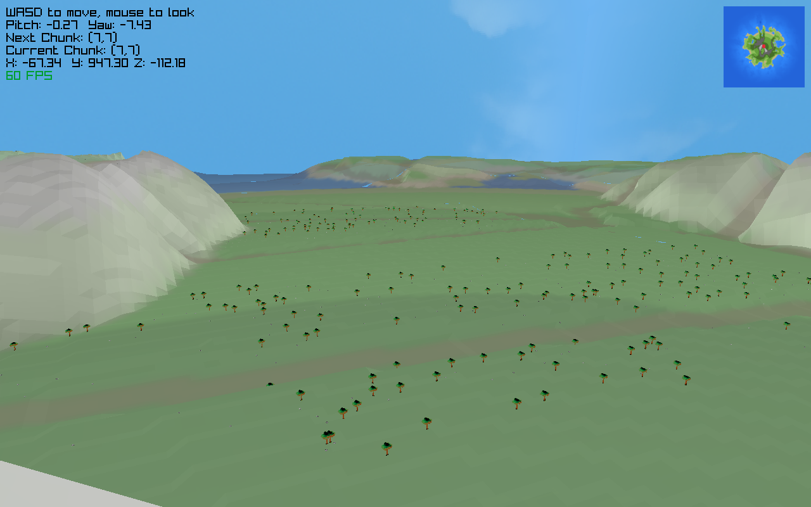

# MapBuilder
A raylib heightmap creation and preview program, and other misc things

create is to create a map out of noise
play is to preview the map after its built
lod demonstrates the LOD system, it might be busted, its old at this point
rock is a rock creator in progress, currently assets are not usable
model_test takes a model as a param and opens it (need to add texture as second param)

when creating a map, be sure to cd map and sh clean.sh, then cd ..
this is because of how the tile system works right now, there is no manifest, so old tiles will get picked up if not deleted first

