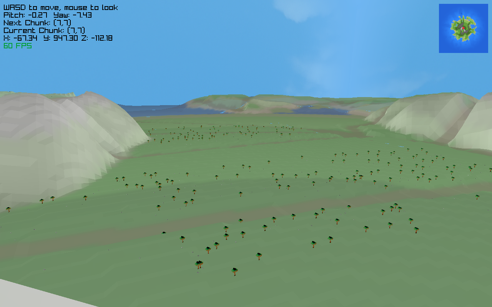
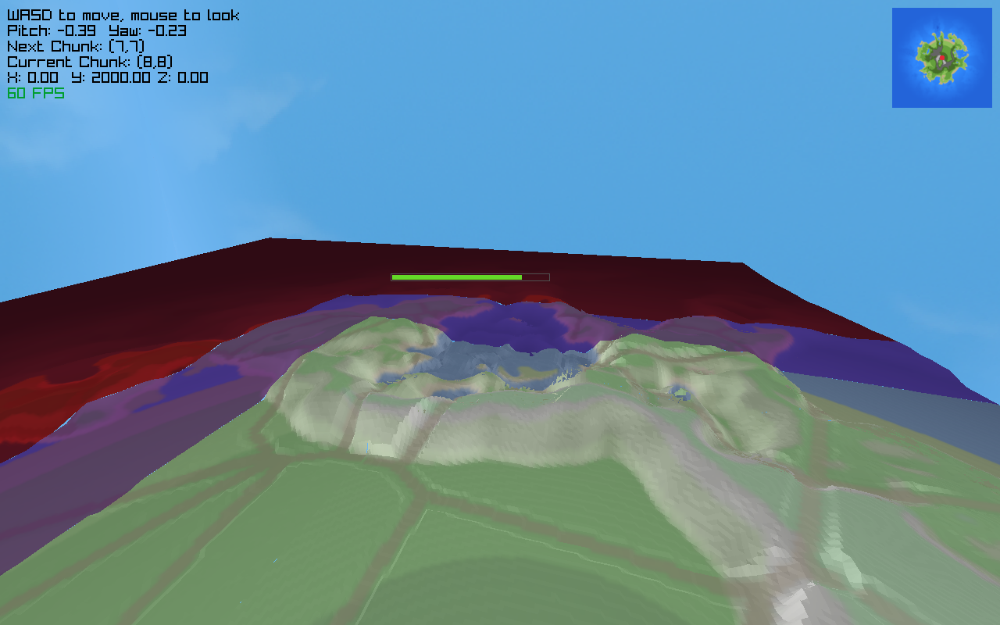
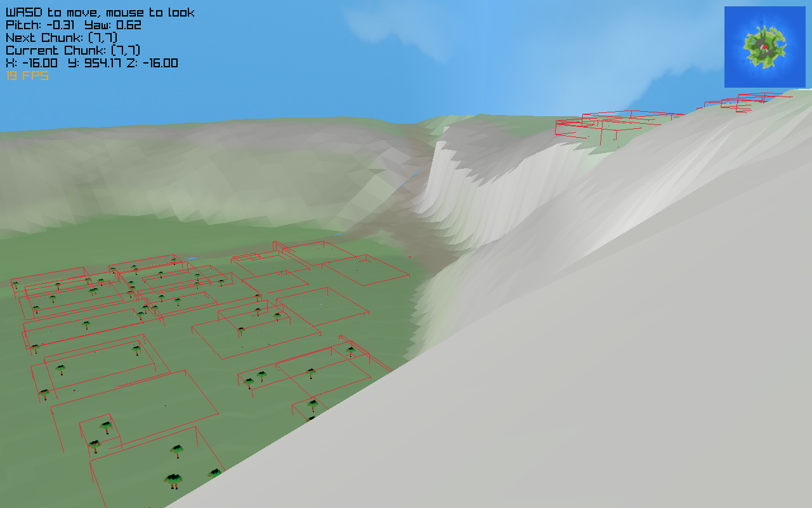
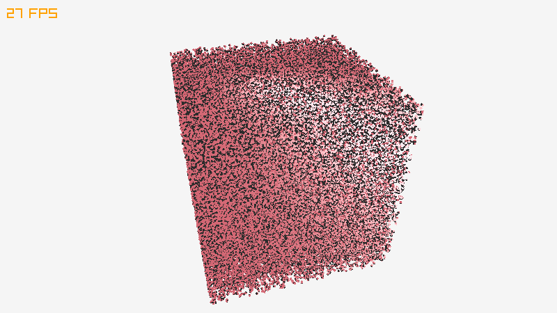
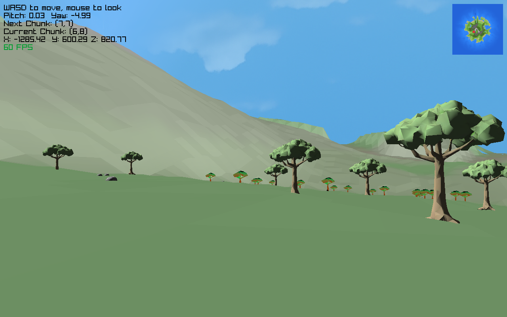

# MapBuilder

A raylib heightmap creation and preview program, and other misc things for building a map for raylib games

Hey! Im Brandon. I just upgraded to a rpi5 (from the old rpi4). 

So far you will find the following programs after running sh build.sh
 - create is to create a map out of noise
 - play is to preview the map after its built
 - lod demonstrates the LOD system for map chunks, (it might be busted, its old at this point)
 - rock is a rock creator in progress, currently assets are not usable
 - model_test takes a model as the first argument and opens it (used for testing if a model will open, and what it will look like)
 - validate_tiles is used to make sure the system created valid batches of objects

The maps are fairly large and there are just too many triangles to render everything at full detail.

Instead I use a two different grid systems.
 - The first is the chunk grid, which manages the ground assets. (mountains, roads, ocean trenches, etc...).
    - 16x16 (256) chunks, roughly 1024 units of world space in each. 
    - uses an LOD system, sizes are 64(full), 32, 16, and 8.
        - each of these is produced from the same orignal hieght map data, but have smaller and smaller numbers of vertices
            - 8 is 8x8, 16 is 16x16, etc...
    - press L and you will see the 32 chunks colored blue, 16 colored purple, and 8 colored red.
    - "active" chunks are full 64 LOD, 3x3 grid centered at the players current chunk. Each level surrounds the next (most chunks are LOD 8)
    - 
 - The second is a tile system for batching objects at a distance.
    - 8x8 grid on top of each chunk. I am still trying to figure out if 8x8 or 16x16 is better.
    - I think, the active tile grid around the player is 7x7, or 9x9, I cant remember which it ends up as (still have yet to write a good tool to see the tiles). 
        - Im happy with the size of the active grid
        - but Ive been noticing trees appear out of no where when you get close. It seems I have a tile bug to fix soon
        - there also might be a bug with the creation of these, they work pretty well, but the boxes around the tiles feel small...
    - LOD 64 chunks will render tiles
        - unless the tile is in the active tile grid, then it will render indivdual objects (right now just trees and rocks) at a higher level of detail
        - used in place of GPU instancing as I dont know hot to work with that for now
            - eventually I think I would like both techniques and we could really render some triangles to the screen
            - there is a trade off between tiles and GPU instancing
                - GPU instancing is a bit slower, but tiles/batches take a lot more memory (GPU and RAM).
    - 

Currently, in the preview program, the map assets are loaded at start up, and just all kept in RAM (and many in the GPU as well)
 - right now the initial loading of the render system is threaded (cool but needs lots of improvement)
    - eventually it will probably be the case that we want to page on and off of the file system, thats gonna be fun...
    - this allows a loading bar to display, so you know its doing something
 - Tiles are actively loaded and unloaded from the GPU, because (and this might be floawed right now) they are instended to be big, lots of triangles

Expect 20-30 minutes atleast for maps to be created (sometimes its faster on better computers)

Also, you have to create a map before you can play it, just wanted to point that out.

--------------------------------------------------------------------------------------------------------
Wanted to document this here, I got Gpu Instancing working on the rpi5.

To get this working I installed raylib like this
 - clone raylib
 - cd raylib folder
 - mkdir build
 - cd build
 - cmake .. -DPLATFORM="Desktop" -DGRAPHICS="GRAPHICS_API_OPENGL_21"
 - make
 - sudo make install
 - sudo ldconfig

You cant use raylib directly, you have to bypass DrawMeshInstanced().
 - the reason I did this is because with the way I built raylib, and that really seemed to be the best way to build raylib for my setup (it worked so I cant complain), rlSetVertexAttributeDivisor will fail as an unbound symbol. I copied raylibs function (sorry ray) and replaced that call with this, glVertexAttribDivisor, open gl directly (I think its open gl, GPU's have a lot of like naming conventions and stuff and it all starts with a 'g' so I get confused).

See the call to DrawMeshInstanceCustom() in gpu_test/test.c
 - Another peice of the puzzle is the shader example from raylibs website called gpu instancing. It had all of the steps to actually get it working. I would check that out as well.

 ------------------------------------------------------------------------------------------------------
Another update, I was able to, alteast on my rpi5, integrate gpu instancing with the preview program

Here is a report, and it could be very flawed, and 2,363,526 seems high, but that is the number I got, with 176 batch calls

Estimated tile triangles this frame  :  74710
Estimated batch calls for tiles      :  71
Estimated tree triangles this frame  :  2192432
Estimated batch calls for trees      :  18
Estimated chunk triangles this frame :  96384
Estimated batch calls for chunks     :  87
Estimated TOTAL triangles this frame :  2363526
Estimated TOTAL batch calls          :  176
Current FPS (so you can document)    :  60

Because of the instancing I can use a better tree model consistantly, and th lighting looks pretty cool.

